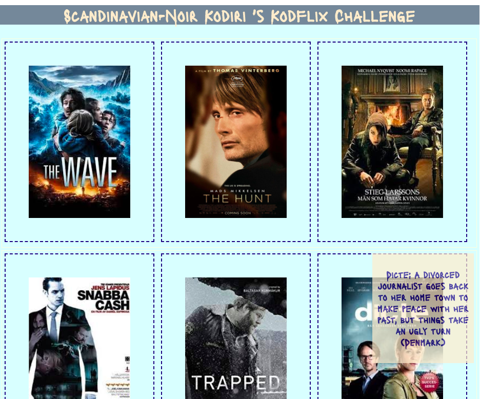

## Kodiri-Kodflix Challenge 2-13


### Set up
[npx create-react-app app-name]
[yarn add react-router-dom]

### Challenges 1-13
* Challenge 1: Clean up react app display 'hello world'
* Challenge 2: Set up your Kodiri-Kodflix project title
* Challenge 3: Add one image
* Challenge 4: Add 5 more images
* Challenge 5: Display them in 2 rows 
* Challenge 6: Display 3 covers per row with the same aspect ratio
* Challenge 7: Mobile first design
* Challenge 8: CSS animation - hover over images
* Challenge 9: Show the title of the film on hover
* Challenge 10: Scale the app by making reusable components
* Challenge 11: Make a new component for the gallery
* Challenge 12: Add routing to create one page that links to a details page
* Challenge 13: Add routing to many pages

#### Image resources
* Google
* ImDB
* VectorStock
* Imgur

Icons resources
* FlatIcons
* Icon Monster
* Font Awesome
* Devicons

Fonts resources
Google Fonts

### React  1 to 10
* Set up the jsx containers - main for the whole project
* 2 rows - row1 and row2 as the row containers
* give each div that holds the images a class name
* use the class name in css to use flex box
* To understand the working of the box-model in css and css grid, put the h1 into a header tag and put it in another color
* You can run a border around the two rows as well if it makes it easier to understand the box model, but the layout could become too cluttered, I used light color and 1px to display the row grid lines that is only just visible to the eye, but gives me an understanding of the different boxes in the css-box model. This will be removed as a last step.

```
.header {
	background: lightslategray;
}

h1 {
	text-align: center;
	color: blanchedalmond;
	font-family: 'Lacquer', sans-serif;
}

.row1,
.row2 {
	display: flex;
	align-items: auto;
	padding: 5px;
	margin: 5px;
}
```

* give the film covers a generic name to reduce styling repetion, and change the position to relative. The title of the film in the h5 jsx tag is relative to the film cover position, the film cover position remains absolute 

```
.film-cover {
	flex: 1;
	position: relative;
}
```
* position the overlay to absolute to pair the parent div with the child element

```
.film-cover-overlay {
	transition: top ease 1s;
	display: none;
	position: absolute;
	width: 100%;
	top: -10px;
	right: 0;
	background-color: blanchedalmond;
	width: 65%;
	align-content: center;
	opacity: 0.7;
}
```
* connect the two with a show - hide or display none and display block and hide the overflow

```
.film-cover:hover .film-cover-overlay {
	display: block;
	top: 0;
}

.film-cover {
	flex: 1;
	position: relative;
	overflow: hidden;
}
```
* Media display changed with a mobile-first design, flex direction changed back to default - coloumns*

```
@media only screen and (max-width: 640px) {
	.row1,
	.row2 {
		flex-direction: column;
	}
}
```
#### Summary 1-10
* Flex alters the default behaviour of jsx-html tags
* By putting elements into a container, each container you display flex
* The elements then gets them into rows
* Each child element flex 1 give you the same column width
* The image aspect-ratios can be managed with auto or specifying size
* The image aspect-ratios need to be changed when you add text as the text now relative to the image occupies a certain height and width that eats into the space.
* To understand the css box-model it is useful to put a border around the image
* Animations like transitions need to be planned, I used a description on hover to give a brief idea of what the film is about as a better ui experience for those not familiar with Scandi-noir


### Elegance and refactoring 10 & 11

* Right click on the app.js file and select the formatter you want to use, set to default and to update formatting on save
* Remove all empty spaces
* Check naming conventions
* Experiment by commenting out unecessary code, styling
* Remove all commented out code and refactor where needed
* Add custom fonts, colours and check look and feel of ui before commiting changes
* Make the code simpler and ('DRY-er')

For example I changed the image sizes a few times - this is the change made for challenge 8

```
img {
	width: 65%;
	height: 75%;
	padding: 45px;
	border: dashed 2px #000080;
}
```
### How react works

React is a javascript library that uses jsx tags. Jsx mimics HTML but is java script.
Jsx elements take attributes that can be styled by are called className not class as class reserved word for constructors in javascript. JSX always has to have 1 root element (div/ main/ section) that encloses the block of code.

Constructors, extend the react component to inherit all the base functionality into a class this then can be exported to other parts of the app.

### Components 10-12
* Create your component by taking the original jsx structure
* Refactor with props - rename the alt, src, jsx h5 tags 

```
import React from 'react';

function FilmCatalog(props) {
	return (
		<div className="film-cover">
			
			<div className="film-cover-overlay">
				<h5>{props.description}</h5>
			</div>
		</div>
	);
}

export default FilmCatalog;
```
* connect them to the parent which is App.js At this stage, you can not have individual names for the covers, descriptions as this will be difficult to scale, so remove the original jsx individual names and descriptions, alt tags etc., so that any film  in the films container can be easily updated.

```
<main className="films-container">
				<div className="row1">
					<FilmCatalog
						cover={bolgen}
						description={`The Wave: A family get trapped when landslide is caused by a tidal wave.(Norway)`}
					/>
```					
### Functional components - stateless

There are 2 types of components, functional or dumb components and components that hold data or state (stateful components.)

A component is a constructor object that creates several components.  By importing the Component constructor we create new classes of components that inherit the properties of the parent React Component and that can be imported and exported to different parts of your app.

```
Import React, {Component} from ‘react’

The class NewComponent extends Component {
 - here it creates a new component which can be rendered through the react render function

render() {
     return( jsx objects that will be exported into the main app and then the main app is imported into root HTML);
 }
}

Export default NewComponent;
```

Presentational components are used for pure rendering of pages or presentation purposes
- Forms
- Nav bars
- buttons
- Pages that are used again and again

They are components that do not have to have state they are also called stateless components

Because they only render something that is passed down as a prop and do no work except render the properties passed down from another component they are also sometimes called a dumb components 

They can be written as anonymous functions but they will not be hoisted Must have a render function that returns something

```
const NewComponent = (properties) => { 
  return ( properties that have been passed down from the component you are extending )
}
```

### Routing with React Router (12 & 13)

* Install the router and import it into the app [yarn add react-router-dom]
* Import the router into the project
* The React-Router needs to be imported once in the main app
* It is important to check the version - the version in this app is 5
* Renaming the BrowserRouter to Router assigns it to a shorter value that you can import 

```
import { BrowserRouter as Router, Route } from 'react-router-dom';
```

* It becomes like any other component to import with one important difference there can only be one parent which is the router that wraps the whole app and all the paths in it, the Route component allows you to specify the path, the exact path ```/ ```and the wild card path ```/:``` that shows paths with ids

```
function App() {
	return (
		<Router>
			<div className="app-container">
				<Route exact path="/" component={FilmCatalogGallery} />
				<Route exact path="/:" scandi-film-details" component={ScandiFilmDetails} />
			</div>
		</Router>
	);
}
export default App;
```

You can link pages with the Link component from the library and then use the Link component

```
import { Link } from 'react-router-dom';
```

```
function FilmCatalog(props) {
	return (
		<Link to="/scandi-film-details" className="film-cover">
			
			<div className="film-cover-overlay">
				<h5>{props.description}</h5>
			</div>
		</Link>
	);
}

export default FilmCatalog;
```